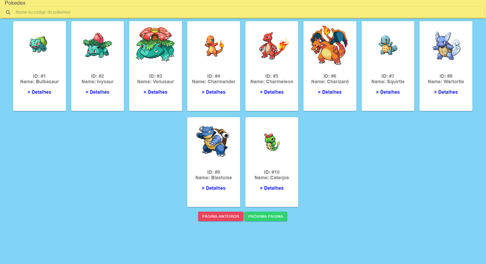
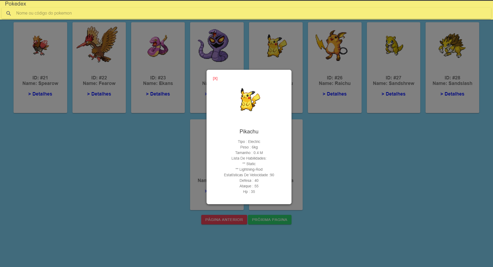
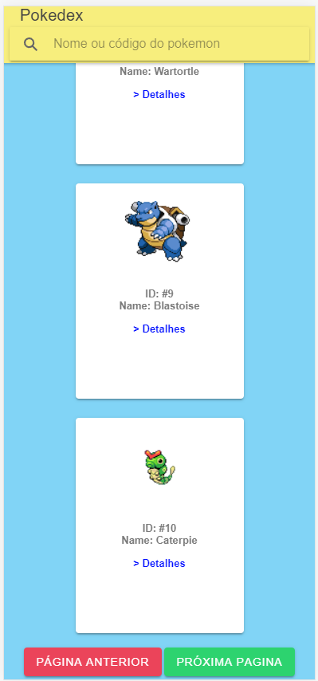
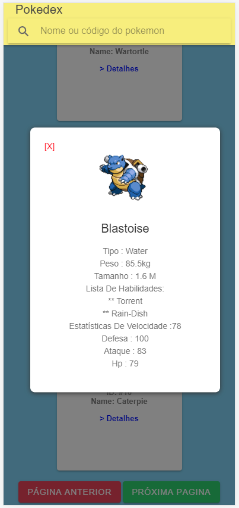

# Introdução
- Website responsivo consumindo a API "PokeAPI".

- Link para a aplicação hospedada no firebase : https://pokedex-77cc4.firebaseapp.com/home

- O projeto foi feito utilizando as ferramentas : Ionic/Angular

# Execução

- Para executar o projeto são necessários : 

- node: Instalação do node https://nodejs.org/en/download/

- Ionic : Tutorial para instalação https://ionicframework.com/docs/intro/cli

- Angular CLI : Tutorial para instalação https://angular.io/guide/setup-local

- Executar o comando npm install via terminal na pasta raiz do projeto.

- Executar ng serve ou ionic serve no repositório.

# Capturas de tela 

## Visão da aplicação - Desktop full-screen

## Modal de status do pokemon - Desktop full-screen

## Visão da aplicação - Mobile

## Modal de status do pokemon - Mobile

